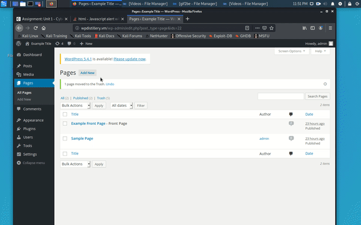
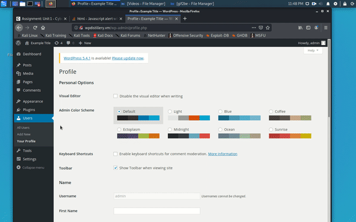
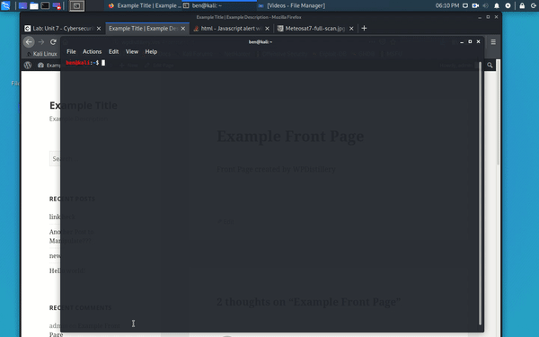
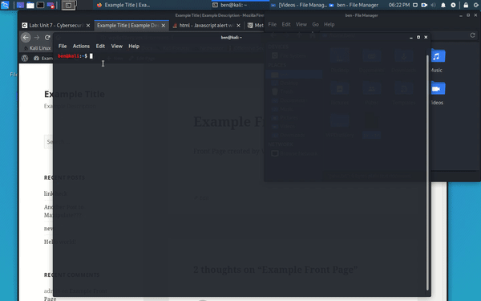

Week 7 & 8 – Kali vs Wordpress

Pentesting

Exploit 1

Vulnerability Type: XSS

Version: 4.2

Patched in Version: 4.2.5

Write Up: Using the plain text editor, we can create a post or page and insert HTML elements.
  1. Create a new page and insert your title
  2. In the plain text section, insert the following line:
    XSS Vulnerability 1[caption width="1" caption='<a href="' ">]</a><a href="http://onMouseOver='alert("Oh no! Call an Admin!")'">XSS Vulnerable</a>
  3. When the page is published, and you hover the text, you get the error alert.

Exploit 2

Vulnerability Type: XSS
Version: 4.2
Patched in Version: 4.7.5
Write Up: You can upload media that is too large to upload and inject and run javascript code. You do so by inserting the javascript into the name of a file that is too big to upload.
  1.Have a image larger than 20MB ready to upload
  2.Rename the file to end with .jpg
  3.When the file is uploaded, the script will run the alert

Exploit 3

Vulnerability Type: User Enumeration
Version: 4.2
Patched in Version: N/A
Write Up: WordPress uses different login error messages which allows us to determine whether the account we tried exists. Our installation does not limit login attempts so we can use wpscan to enumerate the users.
  1.	In Kali terminal we run : wpscan --url http://wpdistillery.vm --enumerate u

Exploit 4

Vulnerability Type: Login Vulnerability 
Version: 4.2
Patched in Version: N/A
Write Up: We can use wpscan to use a text file of common passwords to test against the users we enumerated in the above exploit
1.	In Kali terminal we run : wpscan --url http://wpdistillery.vm –passwords /home/ben/pass.txt --usernames admin

